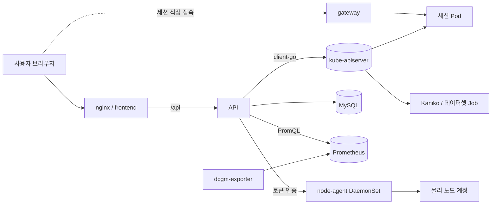
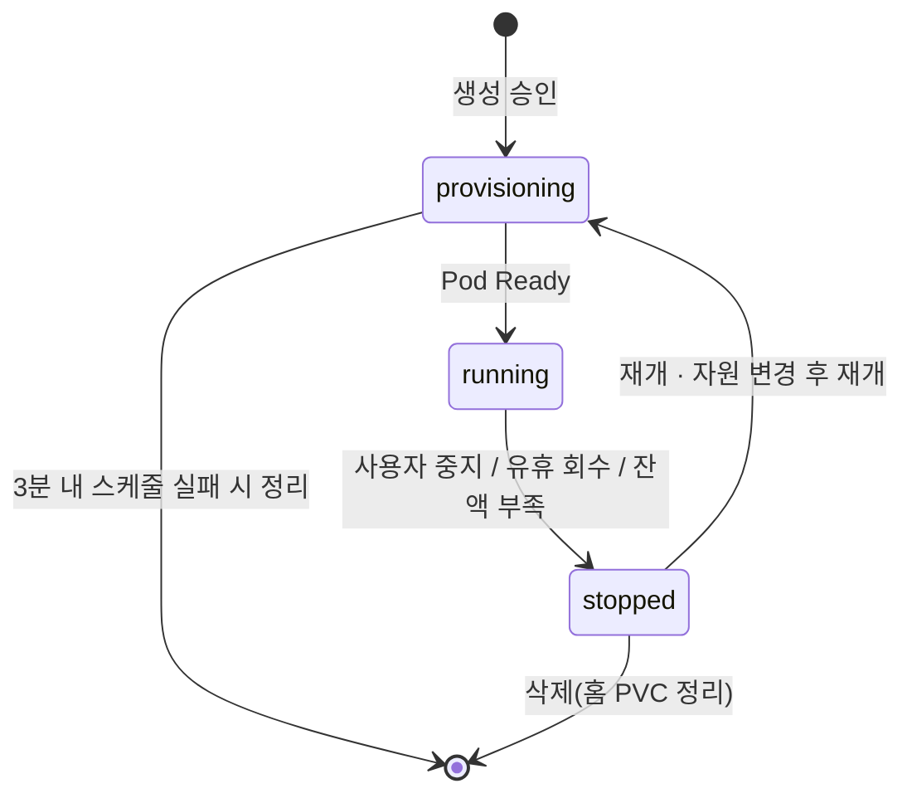

# 아키텍처

## 한 줄 요약

Giosk는 CRD/오퍼레이터가 아니라, **쿠버네티스 API를 호출하는 평범한 웹 백엔드**다.
도메인 상태(사용자, 세션, 지갑, 조직)는 MySQL에 있고, 클러스터는 실행 엔진 역할만 한다.

이 선택의 이유와 대안 검토는 [ADR-0001](adr/0001-kubernetes-native-sessions.md)에 적어 두었다.

## 구성 요소

| 구성 요소 | 경로 | 역할 |
|-----------|------|------|
| **API** | `backend/cmd/api` | Go(Gin) REST API. 인증, 세션, 과금, 조직, 데이터셋, 볼륨, 알림. client-go로 클러스터 제어 |
| **node-agent** | `backend/cmd/node-agent` | DaemonSet. 물리 노드에 리눅스 계정·`authorized_keys`·NFS 마운트를 만든다(hybrid 모드) |
| **gateway** | `backend/cmd/gateway` | 선택. 세션별 서브도메인 웹 접속 + SSH 프록시 단일 접점 |
| **frontend** | `frontend/` | React 콘솔(관리자/사용자). nginx가 정적 파일을 서빙하고 `/api`를 프록시 |
| **MySQL** | 차트 번들 또는 외부 | 시스템 오브 레코드. 마이그레이션은 `backend/internal/store/migrations` |

## 세션의 두 가지 형태

### 컨테이너 세션 (기본)

사용자 네임스페이스(`GIOSK_NS_PREFIX` + 사용자 식별자)에 Pod 하나로 뜬다.

- **채널** — 이미지가 어떤 접속 채널을 제공하는지(`channels` 메타데이터)에 따라 Pod의
  포트·환경변수가 정해진다. VSCode는 8080/`PASSWORD`, Jupyter는 8888/`JUPYTER_TOKEN`.
  Service는 대표 포트만 노출하고 나머지는 게이트웨이가 처리한다.
- **홈** — `/home/work`는 **노드 로컬**이다. 세션별 PVC(`local-path`)로 잡아서 중지해도
  남고 삭제할 때 정리한다. 영속 공유 저장소가 필요하면 `~/nfs`(RWX NFS)를 쓴다.
  왜 홈을 NFS에 두지 않았는지는 [ADR-0004](adr/0004-session-local-home.md).
- **데이터셋** — `~/datasets`에 읽기 전용으로 자동 마운트된다. 노드에 로컬 캐시가 있으면
  hostPath, 없으면 NFS에서 직접 읽는다.
- **`/dev/shm`** — 메모리 기반으로 따로 마운트한다. 기본 64MB로는 PyTorch DataLoader가
  bus error로 죽는다.

### 물리(SSH) 세션 — hybrid 모드

Pod를 만들지 않는다. API가 노드 하나를 통째로 임대하고, node-agent가 그 노드에 실제 리눅스
계정을 만든다. 접속은 SSH 공개키. GPU를 컨테이너 없이 그대로 쓰고 싶은 워크로드용이다.

## 세션 수명주기

승인(admit) 구간은 MySQL `GET_LOCK` 기반 네임드 락으로 직렬화한다. API를 여러 replica로
띄워도 "가용량 검사 → 예약 기록"이 한 번에 하나만 지나가며, 자원 확보에 실패하면 예약을
롤백한다. 예약분과 `provisioning` 상태 세션은 가용량 계산에서 미리 차감한다.

## 자원 모델

GPU는 두 가지 자원으로 따로 집계한다.

| 구분 | 스케줄러 | 가용량 산출 | 표기 |
|------|----------|-------------|------|
| 전용 | 쿠버네티스 기본 | 노드별 유휴 GPU 개수. **물리 개수는 GFD 라벨**(`nvidia.com/gpu.product`)에서 읽는다 | 정수 |
| 공유 | HAMi | HAMi가 광고하는 분할 가용량 | 소수(예: 1.5장) |

전용 GPU 상한은 **클러스터 합계가 아니라 단일 노드의 유휴 최대치**로 잡는다. 한 세션이
여러 노드에 걸쳐 뜰 수 없으므로, 합계로 잡으면 영원히 스케줄되지 않을 요청을 승인하게 된다.
HAMi가 광고하는 capacity를 물리 개수로 오해하면 가용량이 부풀려지는 함정도 여기에 있다.

## 배경 루프

API 프로세스 안에서 도는 주기 작업들이다(`backend/cmd/api/main.go`).

| 루프 | 하는 일 |
|------|---------|
| `RunPhaseReconciler` | Pod 실제 상태를 세션 phase에 반영, 스케줄 실패 세션 정리 |
| `RunIdleReaper` | 유휴 세션 회수. GPU 사용률 + **전력**을 함께 본다([ADR-0005](adr/0005-idle-detection.md)) |
| `RunBiller` | 실행 중 세션의 시간 × GPU 단가를 주기적으로 차감, 잔액 부족 시 중지 |
| `RunStorageBiller` | 볼륨·중단 세션 저장소 과금 |
| `RunCreditRecharge` | 정기 리필(조직/팀/멤버 단위) |
| `RunLeaseReaper` | 유휴한 물리 임대 회수(cordon 후 반납) |
| `RunHomeReaper` | 노드 디스크 임계 초과 시 오래된 세션 홈 정리 |
| `RunReconciler`(image/dataset) | Kaniko 빌드 Job, 데이터셋 적재·캐시 Job 상태 추적 |

## 권한 모델

- **인증** — 세션 쿠키 기반. 계정은 로컬 DB.
- **역할** — `super`(전체) / `org_admin`(조직) / `project_admin`(팀) / 일반 사용자.
- **스코프** — 라우트는 `/api`(공개·인증), `/api/console`(관리자 권한 필요, 스코프 검증),
  `/api/admin`(최고 관리자)로 나뉜다. 겸직하는 관리자는 `X-Console-Scope` 헤더로 현재
  보고 있는 조직·팀을 지정한다.
- **주의** — `org_admin`도 레코드상 `GroupID`가 채워질 수 있다. 권한 판정은 반드시
  `authz.Scope.EffectiveIDs()`로 레벨을 보고 해야 한다.

## 관측

dcgm-exporter → Prometheus → API(PromQL) → 콘솔 순서로 흐른다.
세션별 지표를 뽑을 때 **DCGM이 워크로드 Pod 이름을 `exported_pod` 라벨에 넣는다**는 점이
중요하다. `pod` 라벨만 보면 조용히 빈 결과가 돌아온다.

## 사용하는 쿠버네티스 리소스

Pod, Job, PVC(RWX/RWO), Service(LoadBalancer/NodePort), `remotecommand` exec,
노드 셀렉터·어피니티·taint, ServiceAccount + ClusterRole. 다른 오퍼레이터의 커스텀 리소스도
만든다 — Prometheus `PodMonitor`/`ServiceMonitor`, MetalLB `IPAddressPool`.
